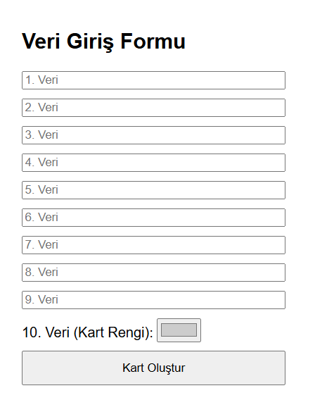

# JS-Dynamic-UI-Card-Generator
# 🎨 Dynamic Form & UI Card Generator / Dinamik Form ve Kart Oluşturucu

[Türkçe açıklamalar için aşağı kaydırın / Scroll down for Turkish]

## 🇺🇸 Project Overview
A JavaScript-based web application that demonstrates advanced **DOM Manipulation** and **Dynamic Styling**. The application processes multi-input form data and generates customized UI cards with conditional logic.

### 📋 Key Features
- **Dynamic Content Generation:** Transforms 10 different user inputs into structured UI components in real-time.
- **Conditional Styling Logic:** 
  - Odd-indexed cards: Center-aligned with a **randomly generated** background color.
  - Even-indexed cards: Left-aligned with a **user-selected** background color via color picker.
- **Pure JavaScript:** Built using Vanilla JS without any external CSS files or frameworks, showcasing core DOM API skills.

### 🛠 Technical Highlights
- `document.createElement` & `appendChild` for dynamic UI building.
- Event listener management and form prevention logic.
- Algorithmic color generation and conditional modulo (%) operations.

---

## 🇹🇷 Proje Hakkında
Bu web uygulaması, ileri seviye **DOM Manipülasyonu** ve **Dinamik Stil Yönetimi** tekniklerini sergileyen JavaScript tabanlı bir çalışmadır. Form üzerinden alınan verileri işleyerek belirli mantık çerçevesinde özelleştirilmiş arayüz kartları üretir.

### 📋 Özellikler
- **Dinamik İçerik Üretimi:** 10 farklı kullanıcı girişini gerçek zamanlı olarak yapılandırılmış UI bileşenlerine dönüştürür.
- **Koşullu Stil Mantığı:**
  - Tek indisli kartlar: Ortalanmış hizalama ve **rastgele üretilen** arka plan rengi.
  - Çift indisli kartlar: Sola dayalı hizalama ve **kullanıcı tarafından seçilen** arka plan rengi.
- **Saf JavaScript:** Harici CSS dosyası veya framework kullanmadan, tamamen Vanilla JS ve DOM API kullanılarak geliştirilmiştir.

### 🛠 Teknik Detaylar
- Dinamik arayüz inşası için `createElement` ve `appendChild` kullanımı.
- Olay dinleyicisi (Event Listener) yönetimi ve form sıfırlama mantığı.
- Algoritmik renk üretimi ve modülo (%) operatörü ile koşullu yapılandırma.

---

## 📸 Preview / Önizleme

